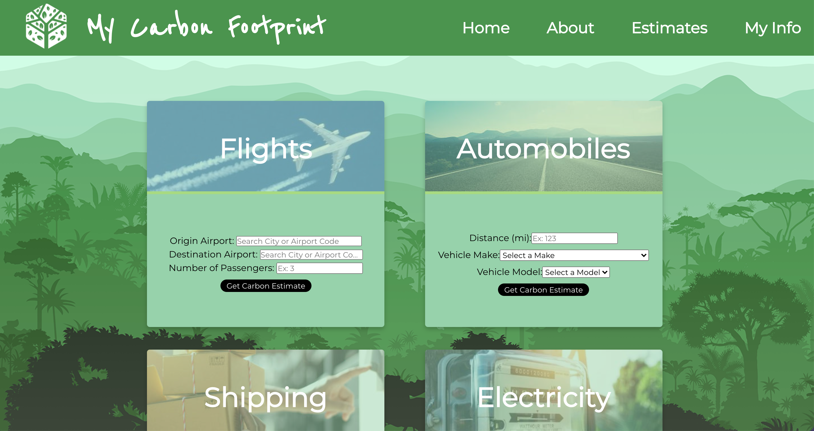

# My Carbon Footprint

My Carbon Footprint takes a look at some of the most common carbon emitting activities and provides users the ability to fill in personal details and receive an estimate of carbon emissions based on data provided by the Carbon Interface REST API. The data that powers the API is sourced from governments, non-profits, and leading researchers around the world including the EPA GHG Protocol and Environment Canada. The app is designed to create awareness by powering carbon measurement to combat climate change.

## Links

See the [front end](https://github.com/e-papanicolas/my-carbon-footprint-react) code.

## Contributors

- [Katherine Roll](https://github.com/katroll)
- [Eleni Papanicolas](https://github.com/e-papanicolas)
- [Hung Le](https://github.com/The-Orange-Dot)
